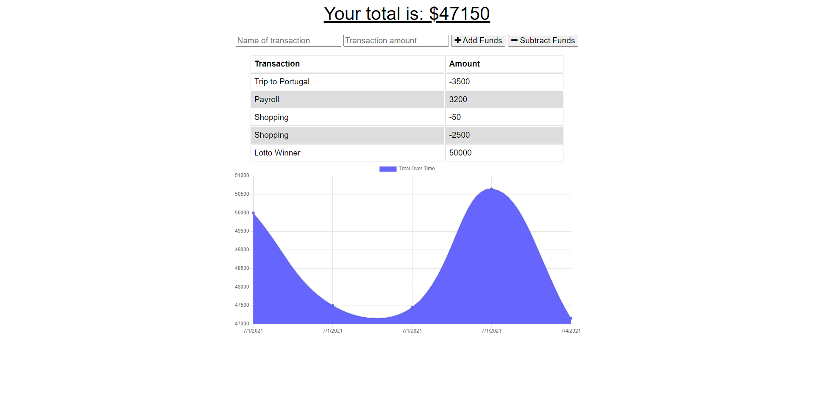

# 19-Online-and-Offline-Budget-Tracker

  # Table of Contents       

* [License](#license)

 * [Description](#description)
 * [Usage](#usage)
 * [Test](#test)
 * [Installation](#installation)
 * [Author](#author)
 * [Contributors](#contributors)
 * [Contact](#contact)
 * [Link](#link)
 * [Screenshots](#screenshots)
 
## License
    
    This project is licensed under the MIT
 
 ## Description:
 * This app allows the user to view, create and track deposits and withdrawals.
 * The user can add deposits and subtract expenses.
 * The user can make changes offline to be updated when back online.
 * 
 ## Usage:
 * Track and update expenses and deposits
 
 ## Test:
  * Currently there is no test available
 
 
 ## Installation:
 * This app can be added to the homescreen from heroku.
 
 ### Author:
  Rebecca Lacer 
 
 
 ### Contributors:
  N/A
 
 
 ### Contact
 
* Github: https://github.com/RLacer
* Email: r.a.lacer@hotmail.com

### Link
Heroku Deployment: https://francophone-parliament-80725.herokuapp.com/
Github Repository: https://github.com/RLacer/19-Online-and-Offline-Budget-Tracker

## Screenshots

<footer>This readme was generated using my homework assignment 9, Node.js readme generator.🏫</footer>
